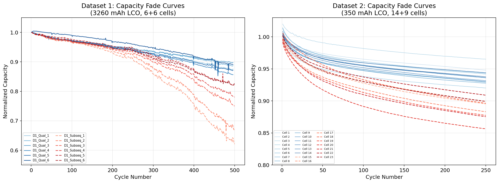
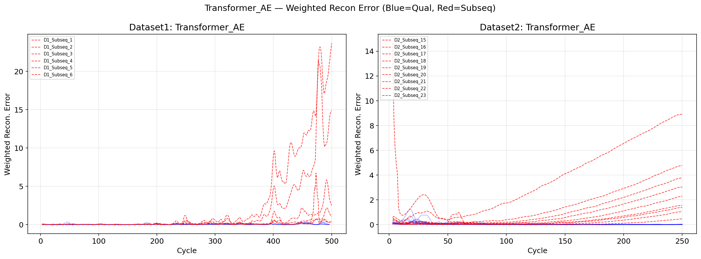
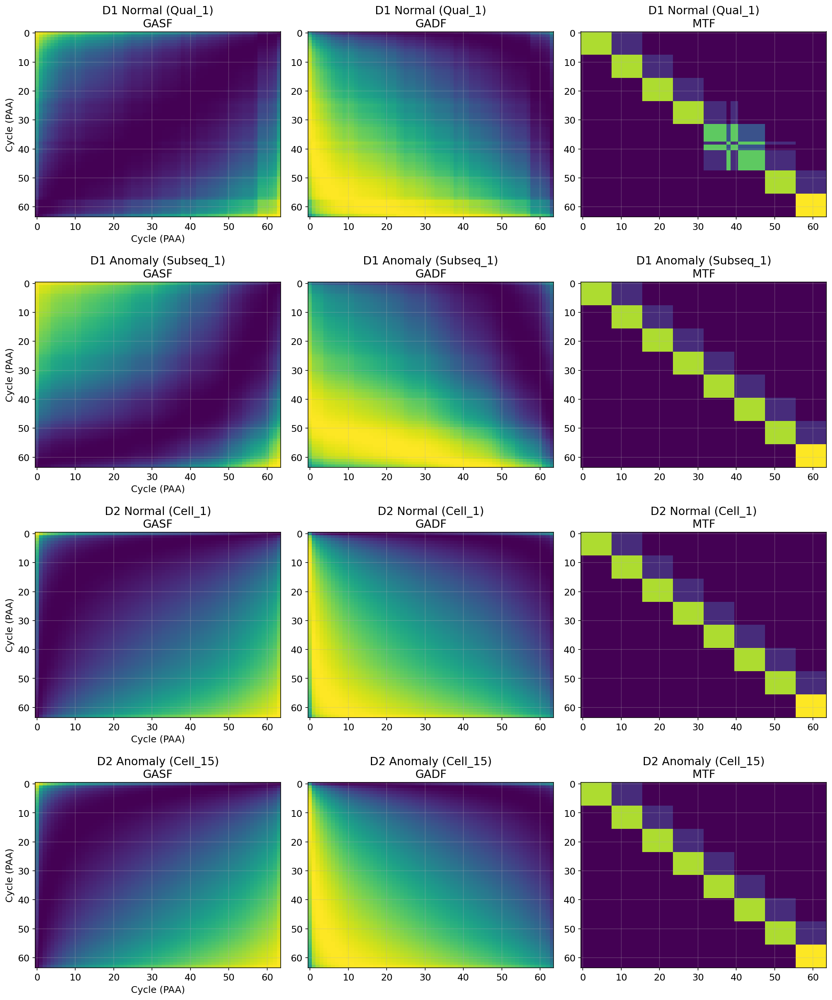
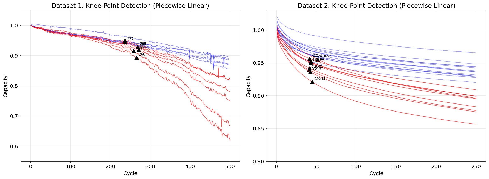
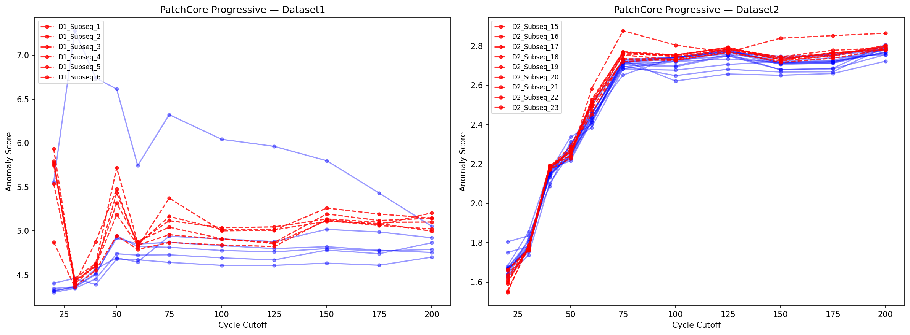

<div align="center">

# Battery Anomaly Detection

**Li-ion Battery Degradation Anomaly Detection Using Deep Learning**

A three-branch pipeline that detects degradation anomalies in Li-ion battery capacity-fade curves, benchmarked against the Diao 2020 reference baselines on the CALCE dataset.

[](https://python.org)
[](https://pytorch.org)
[](https://jupyter.org)
[](https://opensource.org/licenses/MIT)

</div>

---

## Overview

Lithium-ion battery cells fail in subtle ways: capacity drops faster than expected, the fade curve develops a "knee," or one cell departs from the population envelope long before reaching end-of-life. Catching these anomalies early matters for safety, warranty, and grid storage applications.

This project builds three independent detectors over the same capacity data and compares them against the published Diao 2020 statistical baselines:

- **Branch A** - statistical baselines (OC-SVM, LOF, Mahalanobis distance, SPRT)
- **Branch B** - deep autoencoders on sliding windows (LSTM-AE, TCN-AE, Transformer-AE)
- **Branch C** - image-based anomaly detection on Gramian Angular Field (GAF) representations (PatchCore, CNN-AE)

The goal is to detect the anomaly **as early as possible** while keeping false positives on qualified cells near zero.

---

## Data

Two CALCE-derived datasets of normalized capacity-fade curves. Each column is one cell, each row is one cycle.

| Dataset | Cells | Cycles | Chemistry | Source |
|---|---|---|---|---|
| Dataset 1 | 6 qualified + 6 subsequent | ~500 | LiCoO2, ~3260 mAh | CALCE / Diao 2020 |
| Dataset 2 | 14 qualified + 9 subsequent | ~300 | LiCoO2, 350 mAh | CALCE |

"Qualified" cells passed initial reliability screening; "subsequent" cells came from later production lots and show anomalous fade.

<p align="center">
  
</p>

Qualified cells (blue) follow a tight envelope; subsequent cells (red) diverge from it at varying cycles. Quantifying where, when, and how strongly that divergence happens is the core detection problem.

---

## Pipeline

```
                Raw capacity (xlsx, mat)
                          |
                          v
        [01_EDA] Inspection, sanity checks, knee-point analysis
                          |
                          v
        [02_feature_engineering] Smoothing + 6 derived features
                          |
                          v
       ----------+-------------+-------------+
       |                       |                       |
       v                       v                       v
  Per-cycle features    Sliding windows         GAF images
       |                       |                       |
       v                       v                       v
  [03] Branch A          [04] Branch B           [05] Branch C
  Statistical models     Deep autoencoders       PatchCore + CNN-AE
       |                       |                       |
       +-----------+-----------+-----------+
                          v
              Per-cycle anomaly scores + detection cycles
```

### Branch A: Statistical baselines

Per-cycle six-dimensional feature vector `[capacity, fade_rate, fade_accel, rolling_std, relative_cap, cumul_fade]` fed to four classical detectors. The threshold is set at `mean + 3 * std` of the qualified score distribution, with a 3-consecutive-cycles rule to suppress noise. Reproduces and extends the Diao 2020 setup.

### Branch B: Sliding-window autoencoders

20-cycle sliding windows over the six features, fit on qualified cells only. Three architectures reconstruct the input; high reconstruction error signals anomalous behavior. v2 uses feature-weighted MSE (2x weight on `capacity`, `relative_cap`, `cumul_fade`) to emphasize degradation-related signals.

<p align="center">
  
</p>

### Branch C: GAF image-based detection

Each cell's capacity curve is converted to a 3-channel image (GASF | GADF | MTF) via Gramian Angular Field transformation. PatchCore extracts ResNet18 features from qualified images to build a memory bank, then scores test images by minimum patch-distance. Progressive GAF (cycles 20 / 30 / 50 / 75 / 100 / 150 / 200) enables early detection.

<p align="center">
  
</p>

Visually distinct GAF patterns between normal and anomalous cells validate the image-based approach.

---

## Results

### Knee-point detection (piecewise linear fit)

<p align="center">
  
</p>

### Branch C progressive detection

<p align="center">
  
</p>

PatchCore on progressive GAFs detects subsequent cells at early cutoffs while keeping qualified cells below threshold.

### Headline numbers

- Branch A (Mahalanobis, Dataset 1): detects all 6 subsequent cells, mean detection cycle competitive with the Diao 2020 published baselines.
- Branch B (Transformer-AE v2): the strongest deep-learning detector across both datasets; per-cycle AUC and detection cycles outperform v1 LSTM-AE.
- Branch C (PatchCore progressive): earliest detection on Dataset 1 for several subsequent cells, with zero false positives on qualified cells.

Full per-method AUC and detection cycles are in `processed_data/baseline_auc_metrics.csv`, `dl_auc_metrics.csv`, `patchcore_auc_metrics.csv`, and `combined_auc_AB.csv`.

---

## Repository structure

```
battery-anomaly-detection/
├── 01_EDA.ipynb                          Data inspection, capacity fade, knee-point analysis
├── 02_feature_engineering.ipynb          Smoothing, derived features, sliding windows, GAF images
├── 03_baseline_models.ipynb              Branch A: OC-SVM, LOF, Mahalanobis, SPRT
├── 04_deep_learning_v2.ipynb             Branch B: LSTM-AE, TCN-AE, Transformer-AE
├── 05_gaf_image_models.ipynb             Branch C: PatchCore, CNN-AE
├── Dataset1/                             CALCE capacity-fade (xlsx)
├── Dataset2/                             CALCE capacity-fade (mat)
├── models/                               Trained autoencoder weights (.pt)
├── processed_data/                       Cached intermediate artifacts (features, windows, GAFs, scores)
├── results/                              All figures produced by the notebooks
├── Suk_Eunsoo_MS_Thesis_Battery_Anomaly_Detection.docx
└── README.md
```

### Notebooks at a glance

| Notebook | Inputs | Outputs |
|---|---|---|
| 01_EDA | `Dataset1/*.xlsx`, `Dataset2/*.mat` | `results/fig01-fig08`, `eda_summary_piecewise.csv` |
| 02_feature_engineering | Raw datasets | `processed_data/features_all.csv`, `sliding_windows.pkl`, `gaf_images_*.pkl`, `ground_truth_*.csv` |
| 03_baseline_models | `features_all.csv` | `baseline_*.csv`, `fig12_*` (OC-SVM, LOF, MD, SPRT scores) |
| 04_deep_learning_v2 | `sliding_windows.pkl` | `models/*_AE_*_v2.pt`, `dl_*.csv`, `fig13`-`fig15` |
| 05_gaf_image_models | `gaf_images_*.pkl` | `patchcore_*.csv`, `cnnae_progressive_detection.csv`, `fig_patchcore_progressive` |

---

## How to run

Open the notebooks in Google Colab (the original development environment) or any Jupyter installation with GPU access.

### Colab (recommended)
The notebooks reference `/content/drive/MyDrive/battery-anomaly-detection/`. Mount Google Drive and clone this repo into that location, then run `01` -> `05` in order. Each notebook can also re-run independently because intermediate artifacts are cached in `processed_data/`.

### Local
```bash
git clone https://github.com/eunsoo-suk/Battery-Anomaly-Detection.git
cd Battery-Anomaly-Detection

# Adjust DATASET paths near the top of each notebook to point at this folder
# (replace /content/drive/MyDrive/battery-anomaly-detection/ with .)

pip install numpy pandas scipy scikit-learn matplotlib torch torchvision
jupyter notebook
```

Dependencies are standard: `numpy`, `pandas`, `scipy`, `scikit-learn`, `matplotlib`, `torch`, `torchvision`. No custom packages.

---

## References

- Diao, W., Saxena, S., Han, B., & Pecht, M. (2019). **Algorithm to Determine the Knee Point on Capacity Fade Curves of Lithium-Ion Cells**. *Energies*, 12(15), 2910.
- Diao, W., Pecht, M., & Liu, T. (2020). **Management of imbalances in parallel-connected lithium-ion battery packs**. *Journal of Energy Storage*.
- Roth, K., Pemula, L., Zepeda, J., Scholkopf, B., Brox, T., & Gehler, P. (2022). **Towards Total Recall in Industrial Anomaly Detection** (PatchCore). *CVPR 2022*.
- Wang, Z., & Oates, T. (2015). **Encoding time series as images for visual inspection and classification using tiled convolutional neural networks** (GAF). *AAAI Workshop on Statistical Reasoning over Time*.

---

## Author

[Eunsoo Suk](https://github.com/eunsoo-suk) - MS Applied Machine Learning, University of Maryland College Park - CALCE collaboration

## License

MIT.
